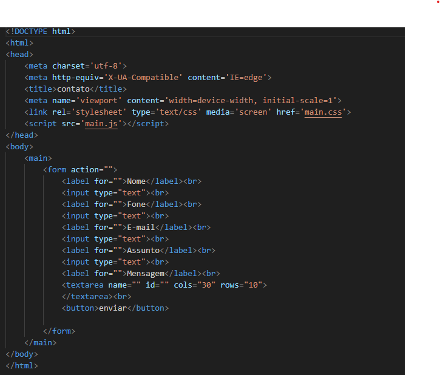
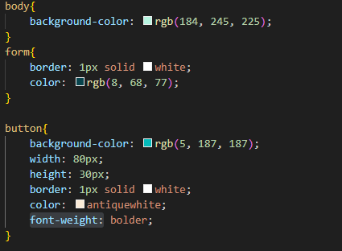
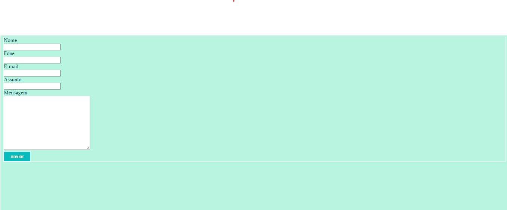

# form-contato
Projeto criado como parte avaliativa da disciplina de Fundamentos de desenvolvimento ministrada pelo professor Leonardo Rocha.
 
## Ìndice
 
* [Descrição](#descrição)
* [Tecnologias](#tecnologia)
* [Referencia](#referência)
* [Autor(a)](#autora)
 
### Descrição
O projeto consiste em uma tela de formulario básico, é possivel mandar uma mensagem de contato onde é
possivel adicionar o nome, telefone, e-mail, o tema da mensagem que sera encaminhada e o espaço para ser digitada a mensagem.
 
### Resultado do projeto
 
#### Tela formulário
 
 * `main`- Entende-se como conteúdo principal aquele relacionado diretamente com o tópico central da página ou com a funcionalidade central da aplicação.
 
* `form`- indica que estamos iniciando um formulário
 
* `input`- Componente que permite a entrada de dados textuais por parte do usuário
 
* `textarea`- é um campo de entrada de texto que permite que seu aplicativo aceite um valor de texto potencialmente longo do usuário.
 
* `button`-representa um botão clicável.

veja uma imagem da parte do código descrita acima:

 
 
### Propriedades CSS
 
* `body` -  representa o conteúdo de um documento HTML. è permitido apenas um por documento.
 
* `background - color` - A propriedade CSS define a cor de fundo de um elemento.background-color 
(cor de fundo).
 
* `form` - Essa tag indica que estamos iniciando um formulário.

 * `border` - define a borda de um elemento.
 
 * `color` - O tipo de dado CSS  indica uma cor no espaço sRGB.

 * `button` -Essa tag é usada para criar um botão de ação dentro de um formulário ou interface. Ela é usada quando queremos que o usuário execute uma ação específica, como enviar um formulário, confirmar uma ação ou executar um script.

 * `width` -  A propriedade CSS width determina a largura da área de conteúdo de um elemento. A área de conteúdo fica dentro do preenchimento, da borda, e da margem de um elemento. 

 * `height` -  A propriedade CSS width determina a largura da área de conteúdo de um elemento. A área de conteúdo fica dentro do preenchimento, da borda, e da margem de um elemento.

 * `font-weight:`- A propriedade CSS define o peso (ou negrito) da fonte. Os pesos disponíveis dependem do que está definido no momento.

veja uma imagem da parte do código descrita acima:

 
 
 
 
#### RESULTADO
 
 

 
 
## Tecnologia
* HTML5
* CSS3
* README
* GIT
* GITHUB
 
## Referência

 [Alura](
https://www.alura.com.br/artigos/escrever-bom-readme
) - Como escrever um README incrivel no seu gitHub  

 [site](https://developer.mozilla.org/en-US/docs/Web/CSS/font-)
 Usado para pesquisa!

 

 
## Autor(a)
O projeto foi desenvolvido por:

Sabrina Cardoso Maciel
 
 